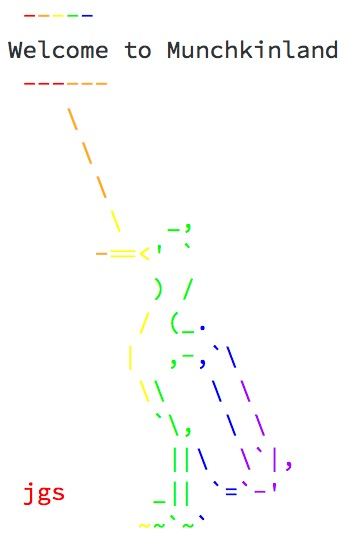
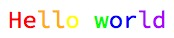
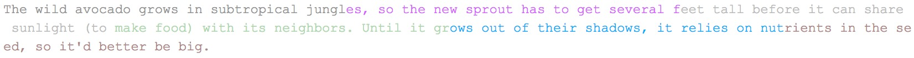
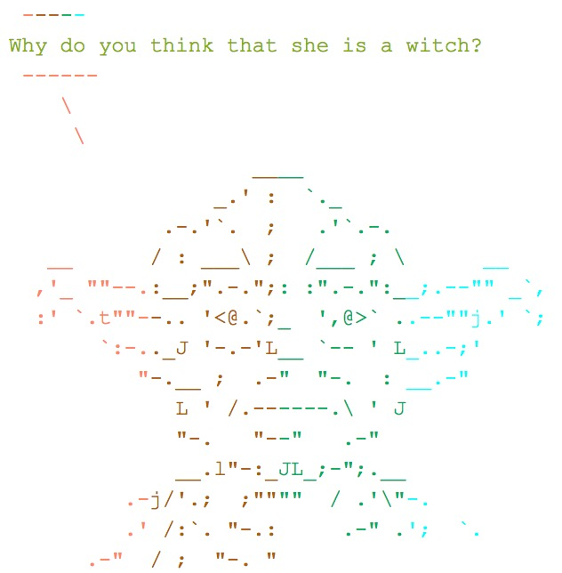
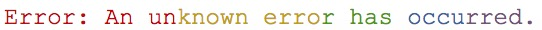
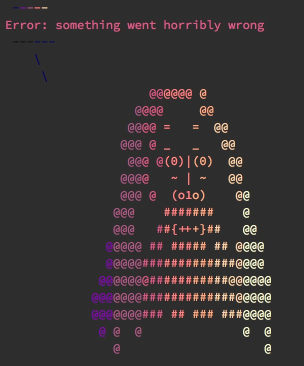
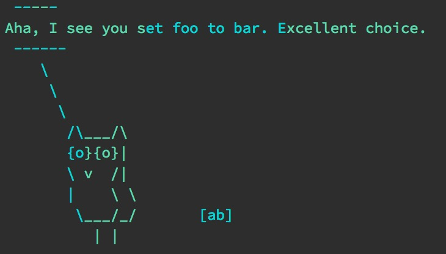

[](https://travis-ci.org/aedobbyn/multicolor)
[](https://codecov.io/github/aedobbyn/multicolor?branch=master)
<!-- [](https://ci.appveyor.com/project/aedobbyn/multicolor) -->


```{r, echo = FALSE}
knitr::opts_chunk$set(
  collapse = TRUE,
  comment = "#>",
  fig.path = "README-",
  eval = FALSE
)
```


# multicolor `r emo::ji("art")` 

Apply multiple colors to your messages and warnings. Built on the [`crayon`](https://github.com/r-lib/crayon) package. Pairs nicely with [`cowsay`](https://github.com/sckott/cowsay).

### Installation 

```{r, eval=FALSE}
# install.packages("devtools")
devtools::install_github("aedobbyn/multicolor")
```


## Usage

```{r}
library(multicolor)
```

Supply a character vector of colors to `colors`. Defaults to `"rainbow"`, i.e., `c("red", "orange", "yellow", "green", "blue", "purple")`. The text supplied will be divided into even(ish) vertical chunks of those colors.

```{r example}
multi_color("Hello world")
```

<p align="left">
  
</p>

If you want the bare string back with color encodings attached, use `type = "string"`.

Ask [important questions](https://youtu.be/B759dzymyoc?t=14s): 

```{r}
multi_color("Why are avocado pits so big?",
  type = "string")
```

<p align="center">
  
</p>

The default is to message the result. 

```{r}
multi_color("The wild avocado grows in subtropical jungles, so the new sprout has to get several feet tall before it can share sunlight (to make food) with its neighbors. Until it grows out of their shadows, it relies on nutrients in the seed, so it'd better be big.",
            sample(colors(), 
                   sample(10, 1)))
```

<p align="center">
  
</p>

### ASCII art with [`cowsay`](https://github.com/sckott/cowsay) 

```{r}
library(cowsay)

say(what = "holygrail", 
    by = "yoda",
    what_color = "olivedrab",
    by_color = c("tomato1", "saddlebrown", "springgreen4", "turquoise2"))
```

<p align="left">
  
</p>

Error in style:

```{r}
my_error <- multi_color("An unknown error has occurred.", 
                        type = "string")

stop(my_error)
```

<p align="left">
  
</p>

And with character:

```{r}
my_msg <- 
  say(what = "Error: something went horribly wrong",
    by = "rms",
    what_color = "orange",
    by_color = c("red", "red", "orange", "red", "red", "orange", "red", "red"),
    type = "string")

e <- simpleError(my_msg)
tryCatch(log("foo"), error = function(e) message(my_msg))
```

<p align="left">
  
</p>


```{r}
this_variable <- "foo"
this_option <- "bar"

say(what = 
      glue::glue("Aha, I see you set {this_variable} to {this_option}. Excellent choice."),
    by = "owl",
    what_color = c("salmon2", "springgreen4"),
    by_color = c("turquoise3", "peachpuff3", "seagreen3"))
```

<p align="left">
  
</p>


