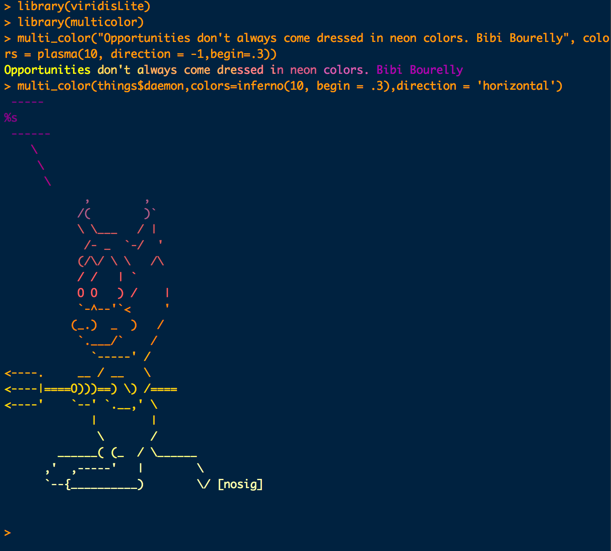
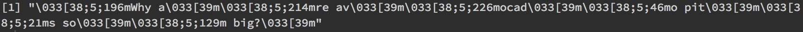
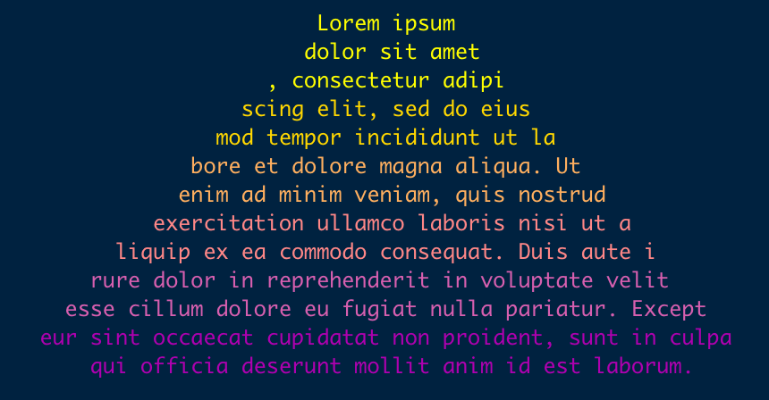
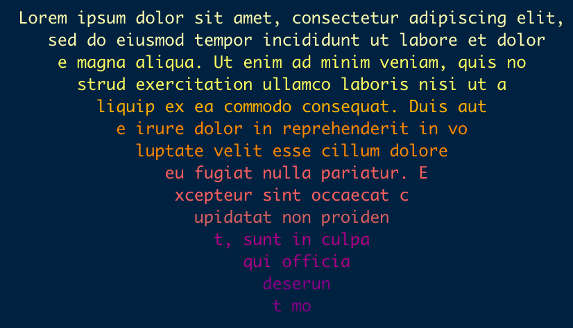

[](https://travis-ci.org/aedobbyn/multicolor)
[](https://ci.appveyor.com/project/aedobbyn/multicolor)
[](https://codecov.io/github/aedobbyn/multicolor?branch=master)
[](https://cran.r-project.org/package=multicolor)
[](https://github.com/metacran/cranlogs.app)

# multicolor 🎨 

Apply multiple colors to your messages, warnings, and errors. Built on
the [`crayon`](https://github.com/r-lib/crayon) package. Pairs nicely
with [`cowsay`](https://github.com/sckott/cowsay). The [blog
post](https://dobb.ae/2018/07/19/how-does-multicolor-actually-work/) has
a bit of backstory and walkthrough of how it
works.

#### New: `multicolor` 0.1.2 now supports RMarkdown with `type = "rmd"`. See package vignette `vignette("rmd", "multicolor")` for examples.

<p align="left">


</p>

### Installation

Stable, from CRAN:

``` r
install.packages("multicolor")
```

or the development version from GitHub:

``` r
devtools::install_github("aedobbyn/multicolor")
```

*Note*: colors cannot be applied in the R GUI and certain other
environments. RStudio or any terminal should work fine<sup>1</sup>.
[RMarkdown](https://github.com/aedobbyn/multicolor/blob/dev/vignettes/rmd.Rmd)
is also in play 👍.

### Usage

``` r
library(multicolor)
```

Supply a character vector of colors to `colors`. This defaults to
`"rainbow"`, i.e., `c("red", "orange", "yellow", "green", "blue",
"purple")`.

``` r
multi_color("Hello world")
```

<p align="left">


</p>

If you want to unveil your creation slowly (as @cortinah’s whale gif
above), use **`crawl`**. You can vary the speed with the `pause`
argument.

<p align="left">


</p>

#### Options

The text supplied will be divided into even(ish) chunks of those colors
when **`recycle_chars`** is false. If it’s true, each color will apply
to a single character, and the `colors` vector will be recycled over the
length of the input string supplied.

Any character vector of R colors or hex values are fair game.

<p align="left">



</p>

The default **`direction`** is vertical, but horizontal is also an
option by setting the `direction` param to “horizontal”.

The default **`type`** messages the result. If you want the bare string
back with color encodings attached, use `type = "string"`, which looks
like:

``` r
multi_color("Why are avocado pits so big?",
  type = "string")
```

<p align="left">



</p>

So you can ask
<a href="https://youtu.be/B759dzymyoc?t=14s" target="_blank">important
questions</a> ☝️and answer them colorfully
👇:

``` r
multi_color("The wild avocado grows in subtropical jungles, so the new sprout has to get several feet tall before it can share sunlight (to make food) with its neighbors. Until it grows out of their shadows, it relies on nutrients in the seed, so it'd better be big.",
            sample(colors(), 
                   sample(10, 1)))
```

<p align="left">


</p>

### ASCII art with [`cowsay`](https://github.com/sckott/cowsay)

All `cowsay` animals are exported in `multicolor::things`, but to get
the animals to speak, you need
[`cowsay`](https://github.com/sckott/cowsay).

``` r
library(cowsay)

say(what = "holygrail", 
    by = "yoda",
    what_color = "olivedrab",
    by_color = colors()[which(grepl("green", colors()))])
```

<p align="left">


</p>

Error in style:

``` r
my_error <- multi_color("An unknown error has occurred.", 
                        type = "string")

stop(my_error)
```

<p align="left">


</p>

And with character:

``` r
my_msg <- 
  say(what = "Error: something went horribly wrong",
    by = "rms",
    what_color = viridisLite::magma(5)[3],
    by_color = viridisLite::magma(10),
    type = "string")

e <- simpleError(my_msg)
tryCatch(log("foo"), error = function(e) message(my_msg))
```

<p align="left">


</p>

Or just send messages to your users that they’ll want to read.

``` r
this_variable <- "foo"
this_option <- "bar"

say(what = 
      glue::glue("Aha, I see you set {this_variable} to {this_option}. Excellent choice."),
    by = "owl",
    what_color = c("seagreen3", "turquoise3", "seagreen3"),
    by_color = c("turquoise3", "seagreen3", "turquoise3"))
```

<p align="left">


</p>

### Reshaping text

`multicolor` includes functions to reshape text strings to create
visually interesting designs. `center_string` centers text strings
within the console, while `triangle_string` can create upward and
downward pointing triangles of varying width. These can be combined with
`multi_color` to create visuals such as these:

``` r
triangle_string(ipsum, step = 4, maxlen = 11, display = TRUE) %>%
    center_string() %>%
    multi_color(direction = "horizontal", viridis::plasma(n = 6, direction = -1, begin = 0.3))
```

<p align="left">



</p>

``` r
triangle_string(ipsum, step = -4, maxlen = 56, display = TRUE) %>%
    center_string() %>%
    multi_color(direction = "horizontal", viridis::inferno(n = 8, direction = -1, begin = 0.3))
```

<p align="left">



</p>

That’s it\! PRs & bug reports v welcome. 🎨

<br>

<sup>1</sup> If coloring isn’t possible, you’ll get a warning on load
and every time `multi_color` evaluates. The `type` argument will
auto-set to `"string"`. To check how these environments are determined,
see
[`multicolor:::use_color`](https://github.com/aedobbyn/multicolor/blob/dev/R/utils.R#L13).
If using `multicolor` in another package, you might consider inserting a
replacement for the case when this evaluates to `FALSE`.
